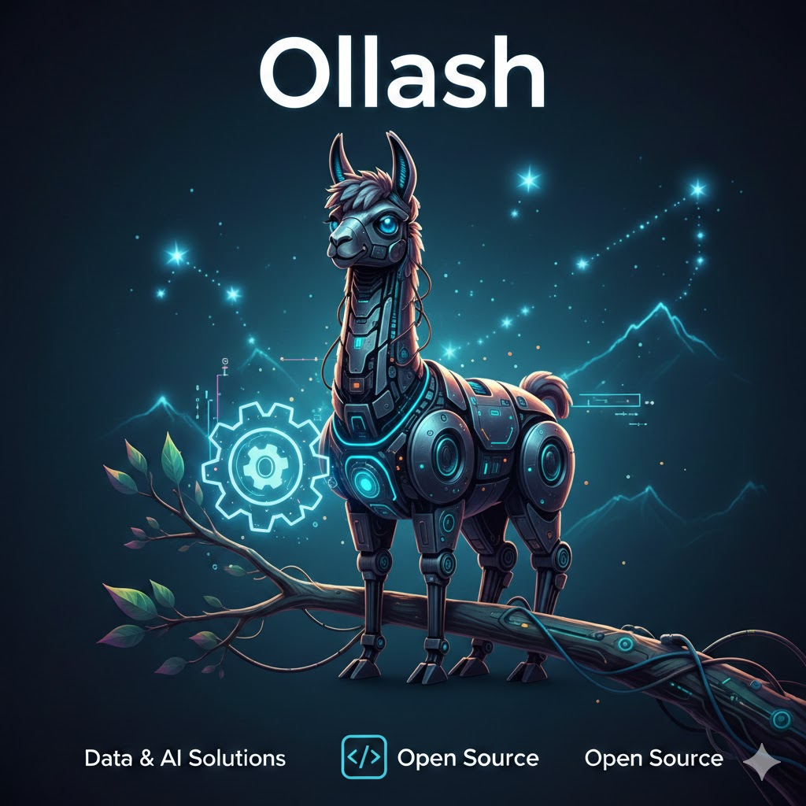

# Ollash - Enterprise Local IT Agent



**Ollash** is an advanced, autonomous AI agent platform designed for local infrastructure management, code generation, and DevOps orchestration. It combines the power of local LLMs (Ollama) with a robust, modular frontend to deliver a secure and intelligent IT assistant.

## 🚀 Key Features

### 🛡️ Enterprise Governance & Resilience
- **Binary Guard:** Strict detection and skipping of binary files (images, audio, etc.) during code generation to prevent LLM corruption and save tokens.
- **Context Anchor:** Robust fallback planning that preserves the original project description intent even during LLM logic planning failures.
- **Resilience Monitor:** Real-time loop detection and contingency planning. Automatically detects stuck agents and proposes alternative execution paths.
- **RBAC Policies:** Granular permission matrix to control agent access to File System, Network, CLI, and Security tools.
- **WASM Sandbox:** Execute generated code in a secure, isolated WebAssembly environment before applying it to your project.

### ⚙️ Operations & Automation
- **Enterprise CLI:** A powerful command-line interface for terminal-based automation and CI/CD integration.
- **Operations Center:** Built-in Task Scheduler (Cron) for automating maintenance scripts.
- **Execution DAG Visualizer:** Preview complex multi-step plans as Directed Acyclic Graphs before execution.
- **Git Integration:** Full version control management directly from the UI (Status, Diff, Commit, Log).

### 🧠 Intelligence & Knowledge
- **Prompts v2 (SQLite + YAML Seed):** Prompts are versioned in SQLite for real-time editing via Prompt Studio, with YAML fallbacks for high reliability.
- **Knowledge Base with OCR:** Drag-and-drop ingestion of PDFs and Images with automatic text extraction.
- **Prompt Studio:** Real-time prompt engineering with integrated linter and security validation.
- **Model Health Routing:** Latency monitoring with automatic fallback strategies for high-availability LLM access.

### 📊 Analytics & Insights
- **Activity Reports:** Weekly productivity summaries (Lines of Code, Time Saved, Error Rates).
- **GPU/Hardware Monitor:** Real-time tracking of GPU load and memory usage to prevent OOM errors.

## 💻 Hardware Requirements & Performance Tuning

Ollash is optimized for high-end local execution while remaining accessible. To maximize the performance of Small Language Models (SLMs) like **Qwen3-Coder:30b**, we recommend the following configurations:

### 🚀 High-End Optimization (Target: RTX 5080 / 64GB RAM)
- **GPU:** 16GB+ VRAM (e.g., RTX 5080, 4090, 3090)
- **RAM:** 64GB
- **Default Configuration (Active):** 
  - `num_ctx: 16384` (16k token window for massive code context)
  - `temperature: 0.1` (Strict precision for logic tasks)
  - `repeat_penalty: 1.15` (Prevents model loops)

### ⚖️ Balanced / Mid-Range
- **GPU:** 8GB - 12GB VRAM (e.g., RTX 4070, 3060)
- **RAM:** 16GB - 32GB
- **Optimization:** 
  - Set `num_ctx: 8192` in your `.env` file to balance context and speed.

### 🐢 Minimum / Low-Power
- **GPU:** Integrated Graphics or CPU-only
- **RAM:** 8GB
- **Survival Mode:** 
  - **CRITICAL:** Change `num_ctx: 4096` in your `.env` to avoid **Out of Memory (OOM)** errors.
  - Performance will be slower, but micro-task execution will remain functional.

> **Note:** The system uses structural XML prompting (`<thinking_process>` and `<code_created>`) and AST-based self-correction to ensure code quality regardless of the hardware tier.

## 🛠️ Installation

1.  **Clone the Repository:**
    ```bash
    git clone https://github.com/your-org/ollash.git
    cd ollash
    ```

2.  **Install Dependencies:**
    ```bash
    python -m venv venv
    source venv/bin/activate  # or .\venv\Scripts\activate on Windows
    pip install -r requirements.txt
    playwright install  # For E2E testing
    ```

3.  **Run the Application:**
    - **Web UI:** `python run_web.py` - Full visual experience for monitoring and interaction.
    - **Enterprise CLI:** `python ollash_cli.py --help` - Command-line power for developers and automation.
    - Access the UI at `http://localhost:5000`.

Check the [CLI Reference Guide](docs/CLI_REFERENCE.md) for detailed documentation of all commands.

## 📂 Project Structure

```text
Ollash/
├── backend/          # Core logic, agents, and system utilities
├── frontend/         # Flask web application and UI assets
├── legacy/           # Relocated legacy scripts and wrappers
├── tests/            # Comprehensive test suite (unit, integration, e2e)
├── docs/             # Technical documentation and CLI reference
├── .ollash/          # Hidden directory for logs, DBs, and vector stores
├── plugins/          # Extensible plugin system for custom tools
├── .github/          # CI/CD workflows and GitHub templates
├── requirements.txt  # Project dependencies
├── run_web.py        # Main entry point for the Web UI
└── ollash_cli.py     # Main entry point for the Enterprise CLI
```

## 🏗️ Code Generation Architecture

The autonomous code generation pipeline follows a clean separation of concerns:

| Component | Responsibility |
|---|---|
| `LogicPlanningPhase` | Generates a structured `logic_plan` per file (purpose, exports, imports, logic) |
| `EnhancedFileContentGenerator` | Creates files from plans; optionally queries `DocumentationManager` for RAG context |
| `CodePatcher` | Handles targeted edits and intelligent merging of **existing** files using `difflib` |
| `PreferenceManagerExtended` | Profile-based, per-user preferences stored in `knowledge_workspace/preferences/` |

> **Note:** `PreferenceManager` (flat `.ollash_preferences.json`) is **deprecated**. Run `migrate_preferences()` from `backend.utils.core.preference_manager` to port data to `PreferenceManagerExtended`.

## 🧪 Testing

We use **Pytest** for backend logic and **Playwright** for frontend E2E tests.

```bash
# Run Unit Tests
pytest tests/unit

# Run Integration Tests
pytest tests/integration

# Run all tests with coverage
pytest tests/unit tests/integration --cov=backend --cov-report=term-missing

# Run a single test file
pytest tests/unit/backend/utils/domains/auto_generation/test_code_patcher.py -v

# Run E2E UI Tests (requires running server)
pytest tests/e2e -m e2e
```

## 🤝 Contributing

Please see `CONTRIBUTING.md` for guidelines. We follow a strict feature-branch workflow with required PR reviews.

---
*Powered by Ollama & Python*
