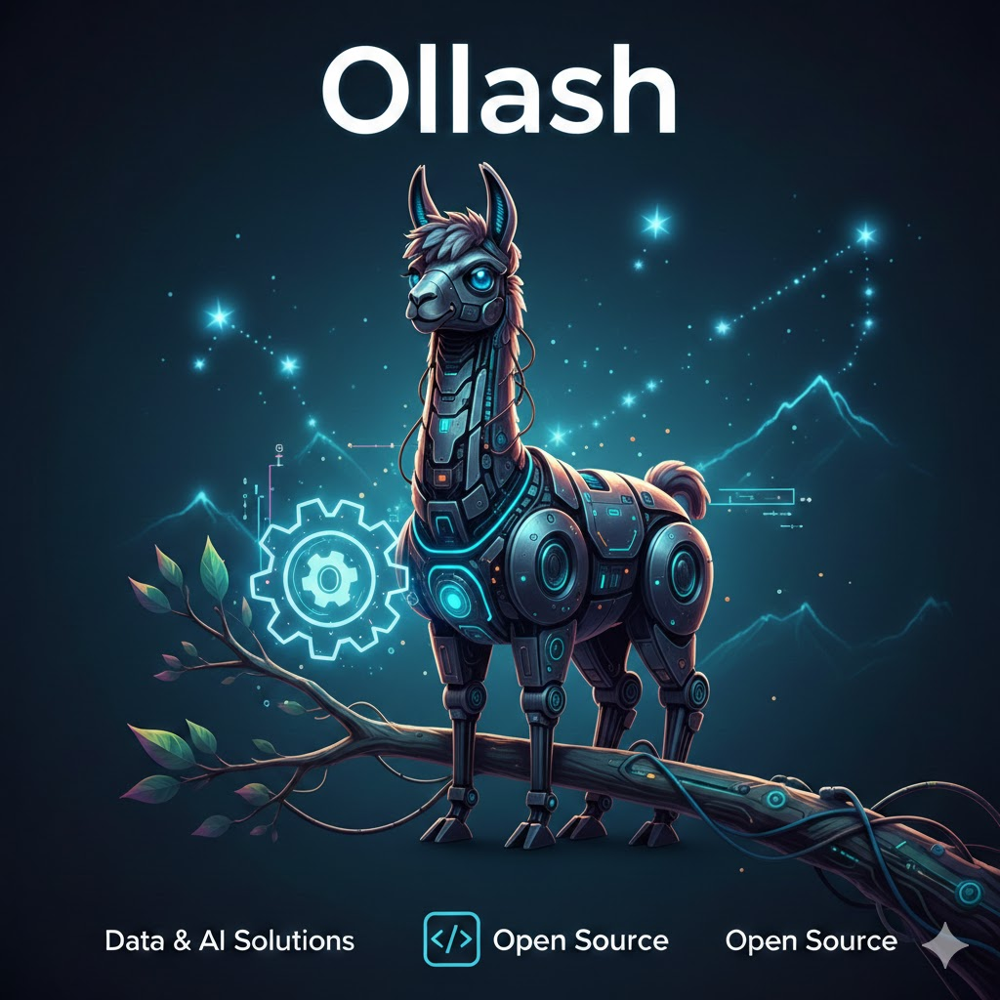

#  Ollash - Local IT Agent

**Ollash** is an advanced AI-powered Code and IT Assistant designed to operate entirely on your local infrastructure using **Ollama**. It combines multiple specialized agents into a cohesive "Agent-per-Domain" architecture to handle everything from complex software development to network analysis and cybersecurity audits.

---

## 🚀 Key Features

### 🧠 Specialized Multi-Agent Swarm
Ollash doesn't rely on a single generic prompt. It employs a team of specialized agents coordinated by a central orchestrator:
*   **Architect Agent:** Designs project structures and identifies dependencies.
*   **Developer Agent:** Writes, refines, and patches code across multiple languages.
*   **DevOps Agent:** Manages CI/CD pipelines and infrastructure generation.
*   **Auditor Agent:** Performs security scans and code quality reviews.
*   **Security Agent:** Monitors for vulnerabilities and enforces safety policies.
*   **Cybersecurity Agent:** Specialized in network audits and vulnerability research.

### 🏗️ Auto-Agent Project Pipeline
Generate complete, production-ready projects from a single text description through a rigorous 8-phase pipeline:
1.  **Analysis & Planning:** Detailed requirement breakdown.
2.  **Structure Generation:** Scaffolding the entire project tree.
3.  **Logic Design:** Planning function-level logic before coding.
4.  **Content Generation:** Parallelized file content creation.
5.  **Iterative Refinement:** Multiple passes to improve code quality.
6.  **Verification:** Automated testing and syntax validation.
7.  **Security & Compliance:** Vulnerability scanning and license checks.
8.  **Final Review:** Senior-level holistic project audit.

### 🌐 Modern Web UI (SPA) — Powered by FastAPI & Vite
A rich, interactive Single Page Application built with FastAPI and modern frontend tools:
*   **Real-time Chat:** Interactive terminal-like chat with tool-calling capabilities.
*   **Architecture Visualization:** Dynamic graphs of your project's structure (Project Graph).
*   **Intelligence Hub:** Explore the agent's Knowledge Base (RAG), Episodic Memory, and Learned Error Patterns.
*   **Time Machine:** Create and restore project checkpoints.
*   **Ops Center:** Monitor background jobs, automation triggers, and system health.
*   **Model Benchmarker:** Compare local LLM performance on standardized tasks.
*   **Prompt Studio:** Integrated environment for live prompt editing and versioning.
*   **Cost Analyzer:** Real-time token usage tracking, cost reports, and model downgrade suggestions.

### 🛠️ Advanced Infrastructure
*   **FastAPI & Uvicorn:** High-performance asynchronous backend.
*   **Smart RAG (ChromaDB):** Semantic search over project documentation.
*   **Self-Healing Loops:** Automatically detects and fixes errors during generation via **Resilience Manager**.
*   **Safe Sandbox:** Executes commands in a controlled environment with policy enforcement.
*   **Hybrid Model Routing:** Automatically selects the best model for each specific task.
*   **HIL (Human In The Loop):** Intercept and edit task instructions in real-time within the DAG dashboard.

---

## 💻 CLI Usage Examples

Ollash provides a powerful CLI to interact with its multi-agent swarm and utility tools.

### 💬 Interactive Chat
Enter an interactive chat session with specialized agents:
```bash
# Start a chat session
python ollash_cli.py chat
```

### 🛠️ Project Generation (Multi-Agent Swarm)
Kickstart a new project with parallel Developer Agents:
```bash
# Generate a modern dashboard with 5 parallel developer agents
python ollash_cli.py agent "Create a React dashboard with TailwindCSS and Chart.js" --name dashboard_pro --pool-size 5
```

### 🐝 Swarm Tasks
Invoke the swarm for quick data processing tasks:
```bash
# Summarize a large document and extract key tasks
python ollash_cli.py swarm "Summarize docs/api_specification.pdf and list required endpoints"
```

### 🛡️ Security Operations
Perform automated vulnerability scans:
```bash
# Scan a directory for common security issues
python ollash_cli.py security scan ./my_new_project
```

### 📊 Benchmarking & Testing
Test local models or generate test suites:
```bash
# Run the model benchmarking suite
python ollash_cli.py benchmark

# Generate unit tests for a Python project
python ollash_cli.py test-gen ./src/core_logic.py
```

### 📁 Git Management
Automate PR creation and management:
```bash
# Prepare a PR description from recent changes
python ollash_cli.py git pr prepare
```

---

## 🛠️ Technology Stack
*   **Backend:** Python 3.x, **FastAPI**, **Uvicorn**, Dependency Injector.
*   **Frontend Integration:** **Vite**, Jinja2, Vanilla CSS/JS (SPA architecture).
*   **LLM Engine:** Ollama (Recommended: `qwen3.5:0.8b`, `qwen3-coder:30b` or `ministral-3:8b`).
*   **Vector DB:** ChromaDB (for long-term memory and RAG).
*   **Memory:** SQLite (for episodic logs and decision tracking).

---

## ⚡ Quick Start

### Prerequisites
1.  Install [Ollama](https://ollama.ai/).
2.  Pull the required models:
    ```bash
    ollama pull qwen3.5:0.8b
    ollama pull qwen3-coder:30b
    ollama pull qwen3-embedding:0.8b
    ```

### Installation
1.  Clone the repository:
    ```bash
    git clone https://github.com/your-repo/ollash.git
    cd ollash
    ```
2.  Set up a virtual environment:
    ```bash
    python -m venv venv
    source venv/bin/activate  # Windows: .\venv\Scripts\activate
    ```
3.  Install dependencies:
    ```bash
    pip install -r requirements.txt
    ```
4.  Configure your environment:
    ```bash
    cp .env.example .env
    # Edit .env to set your OLLAMA_URL
    ```

### Execution
*   **Start the Web UI:** `python run_web.py`
*   **Start the CLI Agent:** `python ollash_cli.py --chat`
*   **Generate a Project:** `python backend/agents/auto_agent.py "Create a FastAPI app with SQLite and JWT"`

---

## 📂 Project Structure
```text
ollash/
├── backend/            # Core logic, agents, and utilities
│   ├── agents/         # specialized agent implementations
│   ├── api/            # FastAPI application, routers and dependencies
│   │   └── routers/    # Domain-specific API endpoints (chat, git, cost, etc.)
│   ├── config/         # JSON configurations and policies
│   ├── core/           # Kernel, containers, and loaders
│   ├── services/       # Core business logic services
│   └── utils/          # Domain-specific tools (git, code, net, etc.)
├── frontend/           # Web UI (templates, static assets)
├── docs/               # Detailed documentation and status reports
├── prompts/            # System prompts for all agent roles
└── .ollash/            # Local data (ChromaDB, logs, checkpoints)
```

---

## ⚡ Optimizaciones para Modelos Pequeños (≤8B)

Ollash incluye 6 optimizaciones ortogonales diseñadas para que modelos pequeños (Qwen2.5-Coder 7B, Llama3.1 8B, Ministral 3B, etc.) generen código de calidad sin saturar su ventana de contexto ni reescribir código ya funcional.

| # | Optimización | Descripción |
|---|---|---|
| **F1** | **Interface Skeleton Scaffolding** | Antes de generar implementaciones, `InterfaceScaffoldingPhase` crea archivos `.pyi` (Python) y `.d.ts` (TypeScript) a partir de los exports del `logic_plan`. El LLM solo "rellena los huecos" de un contrato ya definido. |
| **F2** | **TDD Agéntico en Caliente** | Tras generar cada archivo `.py`, `FileContentGenerationPhase._run_tdd_loop()` genera un test mínimo, lo ejecuta con `pytest` y corrige el código si falla. |
| **F3** | **API Maps (Compresión de Contexto)** | Detecta modelos ≤8B y activa `select_related_files(signatures_only=True)`, reduciendo el contexto a solo cabeceras de funciones/clases. |
| **F4** | **Capas de Abstracción (TACTICAL/CRITIC)** | Agentes `TacticalAgent` (implementación quirúrgica) y `CriticAgent` (escaneo estático contra base de conocimientos de errores). |
| **F5** | **Blackboard como Memoria de Corto Plazo** | Notas concisas en el Blackboard sobre dependencias y exports inyectadas como contexto previo en la tarea siguiente. |
| **F6** | **Parches SEARCH/REPLACE (Diff Quirúrgico)** | Aplica cambios quirúrgicamente sin tocar el resto del archivo mediante bloques `<<<SEARCH>>>...<<<REPLACE>>>`. |

---

## 🔬 Agent Reliability Pack — Small Model Closed-Loop Features

Six orthogonal features that turn small Ollama models (≤8B) into reliable code generators by adding self-correction, memory, predictive loading, chaos testing, live task visibility, and cognitive-load guards.

| # | Feature | File | Default |
|---|---------|------|---------|
| **R1** | **Critic-Correction Closed Loop** | `backend/utils/core/analysis/critic_loop.py` | ✅ enabled |
| **R2** | **Few-Shot Dynamic Store** | `backend/utils/core/memory/fragment_cache.py` | ✅ enabled |
| **R3** | **Predictive Context Loading** | `backend/agents/auto_agent_phases/phase_context.py` | ✅ always-on |
| **R4** | **Chaos Engineering Mode** | `backend/agents/auto_agent_phases/chaos_injection_phase.py` | ❌ disabled |
| **R5** | **HITL Micro-Level DAG Dashboard** | `backend/api/routers/hil_router.py` | ✅ always-on |
| **R6** | **Context Saturation Alerts** | `backend/utils/core/llm/context_saturation.py` | ✅ enabled |

---

## 🛡️ Security & Safety
Ollash is built with security in mind. It includes a **Policy Enforcer** that intercepts all system commands, a **Code Quarantine** for analyzing suspicious snippets, and a **Vulnerability Scanner** to ensure generated code follows best practices.

---

## 📜 License
This project is licensed under the MIT License - see the LICENSE file for details.
